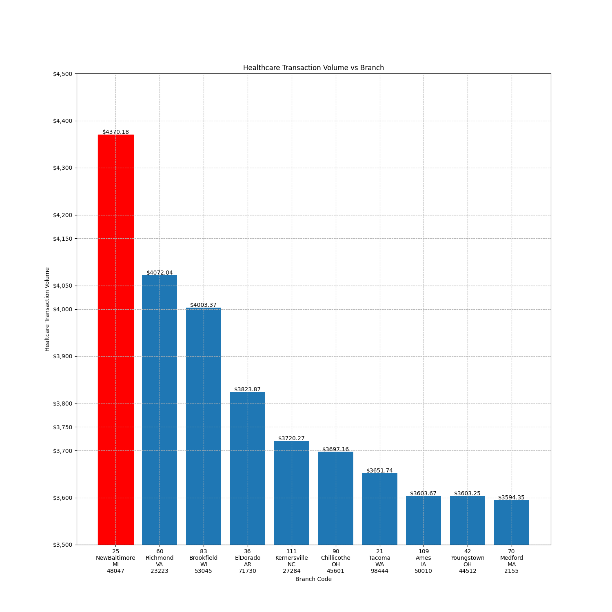

# Bank Management & Loan Approval System - Capstone Project

## Overview

This console-based project offers users insights into bank transactions and customer data, using various data engineering technologies and libraries.

## Libraries and Technologies Used

- `mysql.connector`: To establish a database connection.
- `pandas`: Used for creating dataframes.
- `matplotlib.pyplot`: For data visualizations.
- `pyspark`: For Spark SQL queries and dataframes, and initiating Spark sessions.
- `json`: For reading database credentials from a JSON file.
- `requests`: For obtaining data from the Loan API.
- `time`: To create gaps between program parts.
- `re`: Used for validating email addresses.
- `datetime`: To timestamp customer data updates.

## Features

### Transaction Data

- Users can choose to view transaction data or customer data.
- They can select T for transaction data, C for customer data, or X to exit.

### Transaction Data Options

- When selecting T, users have three choices:
  1. View transactions based on ZIP code, month, and year.
  2. View transaction count and sum for a specific category.
  3. View transaction count and sum for a specific state.

### Customer Data Options

- When selecting C, users have four choices:
  1. View details of an existing customer using SSN or card number.
  2. Update existing customer details.
  3. Generate a monthly bill for a credit card.
  4. Retrieve transaction details for a given date range.

## Example Interaction

- User selects T and chooses to view transactions based on ZIP code, month, and year.
- User provides ZIP code, month, and year.
- Transaction details are displayed.

- User selects C and chooses to update existing customer details.
- User provides the customer's SSN.
- The system displays the current details and prompts for updates for each field.
- The updated customer data is shown.

- User selects C and chooses to generate a monthly bill for a credit card.
- User provides the card number, month, and year.
- The monthly bill amount is displayed.

- User selects X to exit the program.

## Data Validation

- The program ensures user input is accurate and validates data.
- It provides meaningful responses and handles incorrect input gracefully.

## Additional Visualizations

- : Shows categories and the number of transactions per category.
- : Illustrates the states and the number of customers.
- : Shows customer names and the total amount of money spent by each customer.
- : Highlights the top three months in which transactions occurred.
- : Indicates which branch had the most transactions in the healthcare category.
- : Depicts the ratio of people approved for a loan who are self-employed.
- : Demonstrates the ratio of married males approved for a loan, with additional insights.